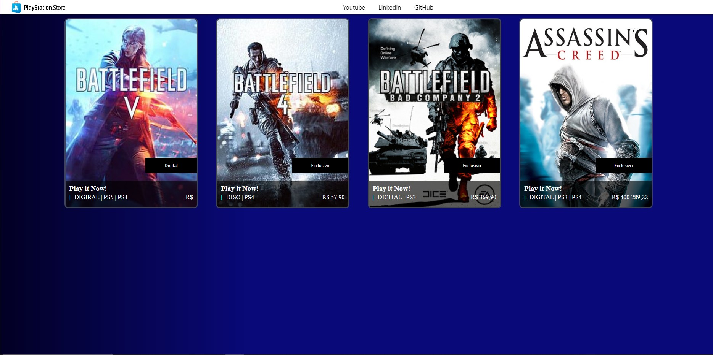

# 🎮 Simulação de Página da PSN  

Este projeto é uma simulação de uma página da PlayStation Store, exibindo cards de jogos com informações como imagem, tipo de mídia e preço. O layout segue um estilo semelhante ao da PSN para proporcionar uma experiência visual familiar.  

---

## 📸 Interface  

A página apresenta jogos organizados em cards, contendo:  
✅ **Imagem do jogo**  
✅ **Tipo de mídia** (Digital ou Disco)  
✅ **Plataforma compatível** (PS3, PS4, PS5)  
✅ **Preço do jogo**  

### 🔹 Exemplo da Interface  

  

---

## 🚀 Tecnologias Utilizadas  

🔹 **HTML** – Estrutura principal da página.  
🔹 **CSS** – Estilização dos elementos para um layout moderno e responsivo.  
🔹 **Web Components** – Uso de componentes personalizados como `<app-card>`.  

---

## 📄 Estrutura do Código  

A estrutura dos jogos é baseada no componente `<app-card>`, que recebe propriedades para exibição dinâmica de informações.  

### 🔹 Exemplo de um Card  

```html
<app-card
    gameImg="./../imgs/bt-5.jpg"
    gameLabel="Digital"
    gameType="DIGITAL | PS5 | PS4"
    gamePrice="R$ 199,90"
></app-card>
```

---
## 🚀 Sobre mim
Eu sou um desenvolvedor full-stack

"Graduando em Ciência da Computação pela Universidade Federal de Alagoas, com grande interesse por tecnologia e desenvolvimento de jogos. Atualmente, estou aprofundando meus conhecimentos em Java, com ênfase no framework Spring, buscando sempre aprimorar minhas habilidades e expandir meu aprendizado na área."
## 🔗 Links
[](https://www.dio.me/users/moraniel)
[](https://www.linkedin.com/in/moraniel/)
[](mailto:moraniel@outlook.com)
[](https://github.com/Moraniel)


